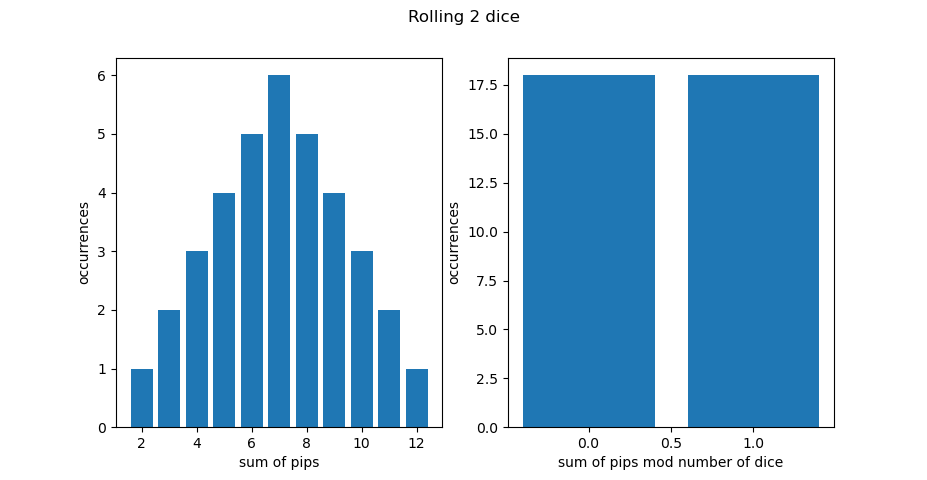
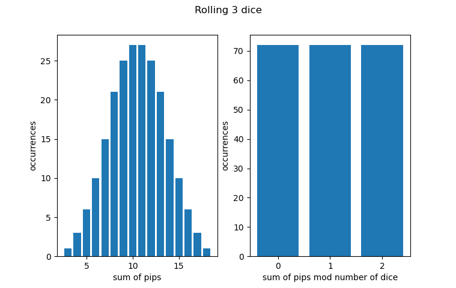
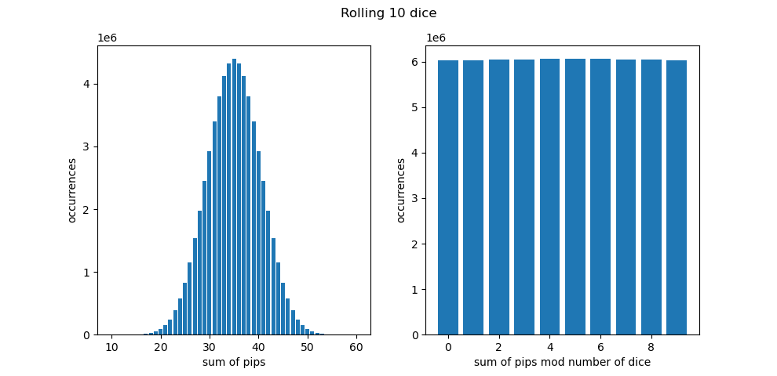

## Overview
Magic the Gathering is a state based card game. Cards are played in various zones with different effects to the game state. Some cards become permanent features in the game zones while others have affects on cards in zones or player's hands.

Cards often require a declaration of *target(s)* in order to be played. Some cards have an additional requirement that the *target(s)* are randomly selected.

## Motivation
This document is a description of a method for selecting randomized targets with the resources available to the players.

My beloved play group has an abundant supply of 6-sided die. We utilize this resource to make a random selection from a set containing multiple valid targets.

## Method
The following steps complete the selection:

- Let $n$ be the number of valid targets
- Let $d_i$ be the value of pips rolled on the $i$ th die

1. Assign each of the *targets* a unique value $v \in \\{0,1,\cdots,n-1\\}$
2. Roll $n$ 6-sided dice
3. Select the *target* that corresponds to the assigned value, $v$, such that:
	
$$ v = (\sum_{i=1}^{n}d_i)\mod n $$

## Justification
This section will attempt to show that each value $v$ has nearly equal probability of occurring. 

### mod
We use **mod** to create $v$ *bins*; we will expect there to be a unique *bin* for each valid target.

Simply stated, this function returns the value of the remainder for integer division.

if $$a = kb | k \in Z^*$$ then $$a \mod b = 0$$

For example:
- Let $a = 7$
- Let $b = 5$

$$ a \mod b \implies 7 \mod 5 = 2 $$ 

### probability
The number of occurrences of a particular dice roll is given by the multinomial theorem.

$$ \binom{n}{k_1,k_2,\cdots,k_m} = \dfrac{n!}{k_1!k_2!\cdots k_m!} $$

Where $k_i$ is the number of occurrences of dice showing $i$ pips. Here, using 6-sided dice for example, $k_m$ would be the number of dice that rolled 6. $n$ is the total number of dice rolled.

The probability of a particular sum of pips is the product of its combinations and occurrences over all possible combinations.

We see that we get the expected distribution of values for rolling 2 6-sided dice; the probabilities for the mod values simulate a coin flip. Unfortunately, the probabilites for the bins are unequal for larger number of dice rolls. I argue that since the method is quick to administer and practically fair, I don't deserve no grief.

Below are bar graphs and probability tables from **plot.py** to illustrate various roll distributions.

### rolling 2 6-sided dice

sum value probabilities:

  value    occurrences    probabilty
-------  -------------  ------------
      2              1       0.02778
      3              2       0.05556
      4              3       0.08333
      5              4       0.11111
      6              5       0.13889
      7              6       0.16667
      8              5       0.13889
      9              4       0.11111
     10              3       0.08333
     11              2       0.05556
     12              1       0.02778

mod value probabilities:

  value    occurrences    probabilty
-------  -------------  ------------
      0             18           0.5
      1             18           0.5

### rolling 3 6-sided dice

sum value probabilities:

  value    occurrences    probabilty
-------  -------------  ------------
      3              1       0.00463
      4              3       0.01389
      5              6       0.02778
      6             10       0.0463
      7             15       0.06944
      8             21       0.09722
      9             25       0.11574
     10             27       0.125
     11             27       0.125
     12             25       0.11574
     13             21       0.09722
     14             15       0.06944
     15             10       0.0463
     16              6       0.02778
     17              3       0.01389
     18              1       0.00463

mod value probabilities:

  value    occurrences    probabilty
-------  -------------  ------------
      0             72       0.33333
      1             72       0.33333
      2             72       0.33333

### rolling 10 6-sided dice

sum value probabilities:

  value    occurrences    probabilty
-------  -------------  ------------
     10              1   1.65e-08
     11             10   1.654e-07
     12             55   9.096e-07
     13            220   3.6384e-06
     14            715   1.18248e-05
     15           2002   3.31094e-05
     16           4995   8.26082e-05
     17          11340   0.000187543
     18          23760   0.000392947
     19          46420   0.000767702
     20          85228   0.00140952
     21         147940   0.00244666
     22         243925   0.00403407
     23         383470   0.00634189
     24         576565   0.00953533
     25         831204   0.0137466
     26        1151370   0.0190416
     27        1535040   0.0253868
     28        1972630   0.0326237
     29        2446300   0.0404573
     30        2930455   0.0484644
     31        3393610   0.0561241
     32        3801535   0.0628704
     33        4121260   0.0681581
     34        4325310   0.0715327
     35        4395456   0.0726928
     36        4325310   0.0715327
     37        4121260   0.0681581
     38        3801535   0.0628704
     39        3393610   0.0561241
     40        2930455   0.0484644
     41        2446300   0.0404573
     42        1972630   0.0326237
     43        1535040   0.0253868
     44        1151370   0.0190416
     45         831204   0.0137466
     46         576565   0.00953533
     47         383470   0.00634189
     48         243925   0.00403407
     49         147940   0.00244666
     50          85228   0.00140952
     51          46420   0.000767702
     52          23760   0.000392947
     53          11340   0.000187543
     54           4995   8.26082e-05
     55           2002   3.31094e-05
     56            715   1.18248e-05
     57            220   3.6384e-06
     58             55   9.096e-07
     59             10   1.654e-07
     60              1   1.65e-08

mod value probabilities:

  value    occurrences    probabilty
-------  -------------  ------------
      0        6031368     0.0997478
      1        6034280     0.099796
      2        6041905     0.0999221
      3        6051330     0.100078
      4        6058955     0.100204
      5        6061868     0.100252
      6        6058955     0.100204
      7        6051330     0.100078
      8        6041905     0.0999221
      9        6034280     0.099796
